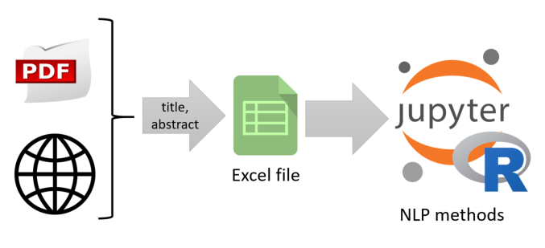

# Quantitative Analysis and Trends of IWSSS Topics

The [International Workshop on Smart Sensing Systems (IWSSS) 2019](https://iwsss19.github.io/) is the fourth in the series since 2016. This work makes the evolution of the IWSSS research area and its topics visible by applying NLP on its publications.

**Take away:** Provide an repeatable approach to follow-up on future IWSSS occasions or apply the methods to other fields and its conferences' publications.

You find the full analysis in the notebook [IWSSSAnalysis.ipynb](notebooks/IWSSSAnalysis.ipynb). There is a [blog post](https://cdeck3r.com/2020-05-31-NLPPaperAnalysis/) showing some selected results. 

## Research Questions 

* How to explore the papers' context to achieve a general understanding?
* What are strong relations connecting all documents with each other?
* What are relevant papers to read?
* What are topics and how do papers correspond to these topics?
* Topic evolution: How much are past topics still present in IWSSS?

## Contribution

Why may you find this work interesting?

As a user you get:

* Important paper reading list
* Topic distribution over years
* Papers from dominating topics

As a data scientist you get:

* Graph visualization and exploration for NLP: wordclouds, bi- and trigrams, word pairs, word correlation analyis 
* Algorithm to select an appropriate correlation coefficient threshold for a pairwise word correlation graph
* tf-idf, LDA topic modeling use cases 

You do not get:

* the latest NLP stuff on word embeddings and neural networks. Nevertheless, this is an interesting area for future extensions.

## Approach

This analysis only utilizes titles and abstracts of paper publications. There are good reasons to focus on these both inputs. Firstly, titles and abstracts are available even when the paper is behind a paywall, secondly, they often come in formats easy to scrape and parse, e.g. from a website. PDF file content may get very hard to parse automatically, because of tables, formulas and images. 

Using papers' titles and abstracts only, we are able to create a complete as possible data base for our analysis. We store the data in the MS Excel format to enable an easy way to manually edit this data base.



## Quickstart: Run your own Analysis 

Clone this repository. It becomes the project root.

```bash
git clone https://github.com/cdeck3r/NLPPaperAnalysis.git
```

### Preps

Create a `.env` file in the project's root specifying global environment variables.
```
# In the container, this is the directory where the code is found
APP_ROOT=/NLPPaperAnalysis

# the HOST directory containing the project's root.
# e.g. /home/username/NLPPaperAnalysis
VOL_DIR=<project root>
```

### Container 

Start in project's root dir. Create docker image:
```bash
docker-compose build rnlp 
```

Spin-up container
```bash
docker-compose up -d rnlp 
```

Point your browser to http://localhost:8888
